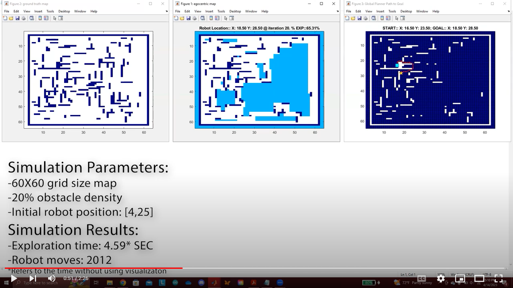

# Informative-Path-Planning23

## Table of Contents
1. [General Info](#general-info)
2. [MATLAB Simulation](#matlab-simulation)
3. [Sources](sources-used)

### General Info
***
In order to assess the efficacy and computational efficiency of the IPP algorithm, which is still in its early stages of development, a 2D simulation was carried out using MATLAB. Both a local and a global planner are included in the described IPP algorithm. The local planner is responsible for exploring the environment directly surrounding the mobile robot, while the global planner is responsible of relocating the robot to previously unexplored regions when the local planner reports that it is unable to continue. The IPP algorithm's emphasize is on the local planner. The global planner is less crucial  since there are many global path search algorithms available that can be used; therefore, the Traditional A-Star algorithm  was chosen.

## MATLAB Simulation
***
The IPP algorithm is shown in a YouTube video [Youtube video](https://youtu.be/Fi9cuvjKcn8) exploring an uknown 2D ground-truth map. The video has a playback speed that is four times faster than the original simulation. It is noteworthy that the IPP algorithm was able to explore the map in 4.59 seconds without the visual aid presented in the video. With the visualization, the IPP algorithm takes more than 20 minutes to explore the map.
 
 ### Screenshot

The visualization contains six figures in total, five of which are updated continuously. A description of each of the figures is described as follows:

* Ground-Truth Map (top-left figure): shows the map that the mobile robot needs to explore, which it does not know anything about.
*  Egocentric Map (top-middle figure): shows the map that the mobile robot updates as it explores the unknown map.
*  Expansion Map (top-right figure): shows the square sensor model used in the mobiel robot.
*  Global Planner Path to Goal (bottom-left figure): shows how the A-Star algorithm generates a path to an unexplored region after the local planner is deactivated and there still exists regions to explore.
*  Expansion Model Update 5X5 (bottom-middle figure): Mobile Robot's zoomed in point of view of the expansion map.
*  All Time Poses of Robot (bottom-right figure): shows the path that the mobile robot takes to explore the unknown map, and it is refreshed every time the IPP algorithm switches between the global and local planner.

### Sources Used
***

The [Traditional A-Star Algorithm coded by Alex Ranaldi](https://github.com/alexranaldi/A_STAR.git) was obtained from GitHub and adapted for use in the IPP algorithm.
